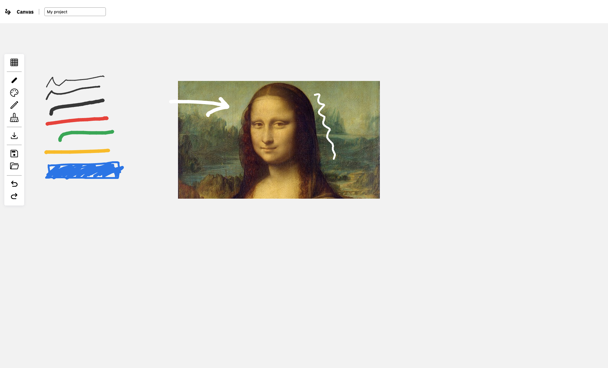

# Canvas

Virtual space for image annotation. [Live demo here](https://genevievemasioni.github.io/canvas/)

## To do

- [ ] Clean the code
- [ ] Open project : check format and info
- [ ] Move image in canvas
- [ ] Zoom in workspace
- [ ] Infinite workspace
- [ ] Pen brushes (ie Photoshop)